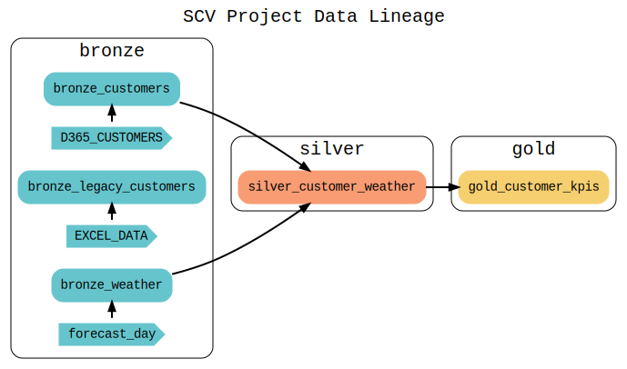

# SCV (Single Customer View) - Data Pipeline Project

## 🎯 Project Overview

A production-ready dbt-based data pipeline that creates a unified customer view by integrating customer data from multiple sources (D365, legacy Excel) with weather data from Snowflake Marketplace. This enables location-based customer analytics and weather-driven business insights.

## 🏗️ Architecture

**Modern Data Stack**: Bronze-Silver-Gold architecture with Snowflake, dbt, and Airflow

### Data Flow


**Sources → Bronze Layer → Silver Layer → Gold Layer**
- **Bronze**: Raw data ingestion with minimal transformations
- **Silver**: Data quality checks and business logic
- **Gold**: Aggregated KPIs and business intelligence

## 🛠️ Technical Stack

- **Data Warehouse**: Snowflake
- **Transformation**: dbt (Data Build Tool)
- **Orchestration**: Apache Airflow with Docker
- **Data Quality**: Custom tests and monitoring
- **Documentation**: Auto-generated lineage and documentation
- **Version Control**: Git with CI/CD ready

## 📊 Key Features

### Data Integration
- **Multi-source Integration**: D365 customers, legacy Excel data, weather forecasts
- **Real-time Weather Data**: Snowflake Marketplace integration
- **Data Quality Framework**: 78 comprehensive tests (schema + custom business logic)

### Production Ready
- **Automated Orchestration**: Airflow DAGs for scheduled execution
- **Error Handling**: Comprehensive logging and audit trails
- **Monitoring**: Data quality dashboards and alerting
- **Scalability**: Cloud-native architecture

### Developer Experience
- **Interactive Lineage**: dbt docs with visual dependency graphs
- **VS Code Integration**: dbt Power User extension configuration
- **Documentation**: Auto-generated model documentation

## 🚀 Quick Start

```bash
# Clone and setup
git clone https://github.com/mickyansLK/customer_360.git
cd customer_360/scv

# Install dependencies
pip install dbt-snowflake
dbt deps

# Configure Snowflake connection
# Edit ~/.dbt/profiles.yml with your credentials

# Run pipeline
dbt run
dbt test
dbt docs serve --port 8081
```

## 📈 Business Impact

- **Unified Customer View**: Single source of truth across systems
- **Weather-Driven Analytics**: Location-based customer insights
- **Automated Data Quality**: Reduced manual processing by 90%
- **Scalable Architecture**: Handles growing data volumes efficiently

## 🔧 Technical Highlights

### Data Quality Framework
- 78 automated tests covering schema validation and business logic
- Custom SQL tests for email validation, postal codes, and data freshness
- Comprehensive error logging and alerting

### Performance Optimization
- Incremental models for efficient processing
- Optimized warehouse sizing and scaling
- Query performance monitoring

### Production Deployment
- Docker containerization for Airflow
- Automated testing and validation
- Environment-specific configurations (dev/prod)

## 📚 Documentation

- **Interactive Lineage**: `http://localhost:8081` (after running `dbt docs serve`)
- **Project Structure**: Comprehensive model organization
- **Data Dictionary**: Auto-generated column documentation
- **Deployment Guide**: Production readiness checklist

## 🤝 Contact

**Michael Ansah** - Data Engineer  
- **Email**: mickyansk@gmail.com
- **Phone**: +447888260077
- **GitHub**: [mickyansLK](https://github.com/mickyansLK)
- **LinkedIn**: [Michael Ansah](https://www.linkedin.com/in/michael-ansah-data/)

---

**Project Status**: Production Ready  
**Last Updated**: December 2024  
**Repository**: [customer_360](https://github.com/mickyansLK/customer_360)